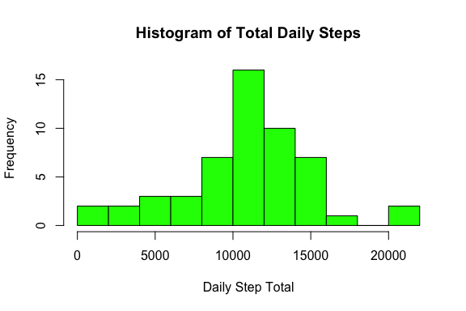
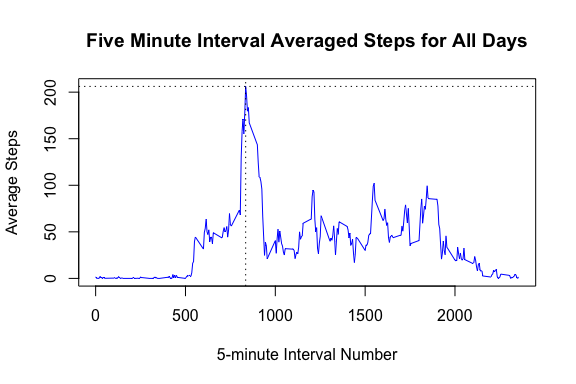
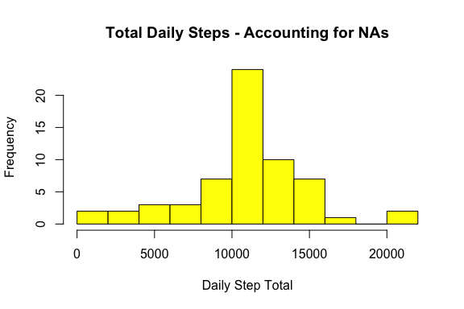
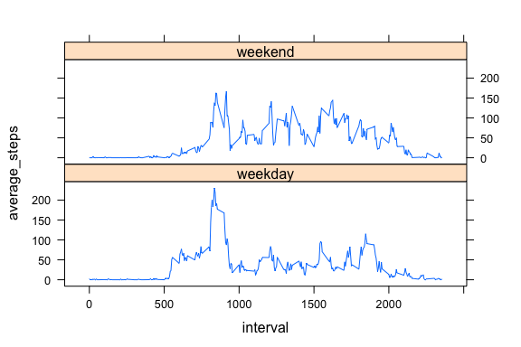

# Reproducible Research Assignment 1
Brian Moore  
10 January 2016  

### Loading & preprocessing the data

To prepare the workspace for analysis & data prep I load a helful package: dplyr. Then we import the raw data to the workspace and take a few preliminary measures to see what it looks like. Noting there is a date column, we modify it be a date-recognized column.


```r
library('dplyr')
```

```
## 
## Attaching package: 'dplyr'
```

```
## The following objects are masked from 'package:stats':
## 
##     filter, lag
```

```
## The following objects are masked from 'package:base':
## 
##     intersect, setdiff, setequal, union
```

```r
# Locate, load summarize & preview file(s)
setwd("~/Documents/Jowwbah - Type Stuff/Data/reproducible research/assignment 1")
raw_data <- read.csv("activity.csv", header=TRUE)
head(raw_data)
```

```
##   steps       date interval
## 1    NA 2012-10-01        0
## 2    NA 2012-10-01        5
## 3    NA 2012-10-01       10
## 4    NA 2012-10-01       15
## 5    NA 2012-10-01       20
## 6    NA 2012-10-01       25
```

```r
summary(raw_data)
```

```
##      steps                date          interval     
##  Min.   :  0.00   2012-10-01:  288   Min.   :   0.0  
##  1st Qu.:  0.00   2012-10-02:  288   1st Qu.: 588.8  
##  Median :  0.00   2012-10-03:  288   Median :1177.5  
##  Mean   : 37.38   2012-10-04:  288   Mean   :1177.5  
##  3rd Qu.: 12.00   2012-10-05:  288   3rd Qu.:1766.2  
##  Max.   :806.00   2012-10-06:  288   Max.   :2355.0  
##  NA's   :2304     (Other)   :15840
```

```r
# modify data types
raw_data$date <- as.Date(raw_data$date, '%Y-%m-%d')
total_test_length_days <- max(raw_data$date) - min(raw_data$date)
```

#### Remove NAs
The first few questions of the assignment do not require special handling of NA values. In fact, the assignment summary suggests ignoring them to begin with, so I subset the raw_data to remove NA values.


```r
# Create subset of data with no NAs, preview 
new_data <- filter(raw_data, !is.na(steps))
head(new_data)
```

```
##   steps       date interval
## 1     0 2012-10-02        0
## 2     0 2012-10-02        5
## 3     0 2012-10-02       10
## 4     0 2012-10-02       15
## 5     0 2012-10-02       20
## 6     0 2012-10-02       25
```

```r
summary(new_data)
```

```
##      steps             date               interval     
##  Min.   :  0.00   Min.   :2012-10-02   Min.   :   0.0  
##  1st Qu.:  0.00   1st Qu.:2012-10-16   1st Qu.: 588.8  
##  Median :  0.00   Median :2012-10-29   Median :1177.5  
##  Mean   : 37.38   Mean   :2012-10-30   Mean   :1177.5  
##  3rd Qu.: 12.00   3rd Qu.:2012-11-16   3rd Qu.:1766.2  
##  Max.   :806.00   Max.   :2012-11-29   Max.   :2355.0
```


### What is mean total number of steps taken per day?
In order to summarise data on a daily basis, we sum the steps for all intervals along each day into a new variable called *daily_bread*


```r
# Aggregate sum of steps by day
daily_bread <- new_data %>%
   group_by(date) %>%
      summarise(daily_total_steps=sum(steps))
head(daily_bread)
```

```
## Source: local data frame [6 x 2]
## 
##         date daily_total_steps
## 1 2012-10-02               126
## 2 2012-10-03             11352
## 3 2012-10-04             12116
## 4 2012-10-05             13294
## 5 2012-10-06             15420
## 6 2012-10-07             11015
```

```r
# Plot histogram of activity
hist(x = daily_bread$daily_total_steps, plot = TRUE, col = 'green', breaks = 10, 
     xlab = 'Daily Step Total',
     main = "Histogram of Total Daily Steps")
```

\

```r
# Compute mean + median daily steps
print(c("Average daily steps:", mean(daily_bread$daily_total_steps)))
```

```
## [1] "Average daily steps:" "10766.1886792453"
```

```r
print(c("Median daily steps:", median(daily_bread$daily_total_steps)))
```

```
## [1] "Median daily steps:" "10765"
```

### What is the average daily activity patern?

To answer this question, we need to aggregate the step data by interval similar to the way we aggregated by day for the last question. Except this time, in order to get the average steps per interval by day, we must average (rather than sum) the steps at each interval over multiple days.


```r
# Aggregate by interval of new_data with average steps at each interval
interval_base <- new_data %>%
   group_by(interval) %>%
   summarise(avg_steps=mean(steps))

# Calculate the max average interval
avg_step_interval_max <- top_n(interval_base, 1, avg_steps)
print(avg_step_interval_max)
```

```
## Source: local data frame [1 x 2]
## 
##   interval avg_steps
## 1      835  206.1698
```

We suspect the top row sorted by average steps is  **Interval number 835** of about **206 steps**. Let's see if the plot validates this. We will also see the broader trend over the course of a single day since we have one observation for each interval in our subset *interval_base*.


```r
plot( x = interval_base$interval, y = interval_base$avg_steps, 
      xla = '5-minute Interval Number', ylab = 'Average Steps',
      type = 'l', col = 'blue', lwd = 1)
title(main="Five Minute Interval Averaged Steps for All Days")
abline(a=NULL, b=NULL, h=(avg_step_interval_max[2]), lty=3 )
abline(a=NULL, b=NULL, v=(avg_step_interval_max[1]), lty=3 )
```

\

### Imputing missing values
First, let's see how many NA values exist for step count by comparing the number of observations in our original *raw_data* variable and the filtered subset *new_data*


```r
nrow(raw_data) - nrow(new_data)
```

```
## [1] 2304
```

This is a significant number, so instead of removing the NAs all together, let's instead replace them with the average for the interval as stored in our variable *interval_base*. While we could impute a daily average for each missing value, some days have no data whatsoever like **2012-10-01**

First we'll make a subset of the NAs only:


```r
na_data <- filter(raw_data, is.na(steps))
```

Then we'll input average steps for each interval in the NA set by joining to the *interval_base* variable which is aggregated to one row per interval, averaged over all non-NA days in the original *raw_data*. In the same step using the **dplyr** package, we reorder and rename the columns to align with our original data.


```r
na_data <- left_join(na_data,interval_base, by = 'interval') %>%
   select(steps = avg_steps, date, interval)

# preview the data
head(na_data)
```

```
##       steps       date interval
## 1 1.7169811 2012-10-01        0
## 2 0.3396226 2012-10-01        5
## 3 0.1320755 2012-10-01       10
## 4 0.1509434 2012-10-01       15
## 5 0.0754717 2012-10-01       20
## 6 2.0943396 2012-10-01       25
```

We're almost ready to join it back to our first subset of *raw_data*; *new_data* from which we removed all the NAs. The final thing before this is to round the steps on each interval to the nearest whole number, and reset the data type as integer so it joins well with the other data frame:


```r
na_data$steps <- as.integer(round(na_data$steps))
```

Now stack the data with the original *new_data* where we removed NAs. Then we'll order the entire *cleaned_data* by date and interval:


```r
cleaned_data <- union(na_data, new_data) %>%
   arrange(date,interval)
```

Then in order to compare this data set to the average daily steps we first calculated, let's aggregate by day and plot the total steps by day in a histogram like we originally did without correcting for NAs: 


```r
clean_daily <- cleaned_data %>%
   group_by(date) %>%
      summarise(daily_total_steps=sum(steps))

# Create a histogram of the revised data
hist(clean_daily$daily_total_steps, plot = TRUE, col = 'yellow', breaks = 10, 
     xlab = 'Daily Step Total',
     main = "Total Daily Steps - Accounting for NAs")
```

\

This looks slightly different than our original histogram. Let's recalculate the mean and median daily total steps of our new data set:


```r
## Compute mean + median daily steps accounting for NAs
print(c("NA's corrected average daily steps:", mean(clean_daily$daily_total_steps)))
```

```
## [1] "NA's corrected average daily steps:"
## [2] "10765.6393442623"
```

```r
print(c("NA's corrected median daily steps:", median(clean_daily$daily_total_steps)))
```

```
## [1] "NA's corrected median daily steps:"
## [2] "10762"
```

### Are there differences in activity patterns between weekdays and weekends? 
For the final task of the assignment, we create a new factor variable with two values, either "weekday" or "weekend" indicating whether a given date is a weekday or weekend day using the full data set:


```r
# append the weekday to all rows of cleaned_data using weekdays() function
cleaned_data <- mutate(cleaned_data, day_of_week = weekdays(cleaned_data$date, abbreviate = TRUE))
cleaned_data$day_of_week <- gsub("Mon|Tue|Wed|Thu|Fri",'weekday', cleaned_data$day_of_week) 
cleaned_data$day_of_week <- gsub("Sat|Sun",'weekend', cleaned_data$day_of_week) 
```

Next we aggregate the data to be averaged for one row per interval for each weekdays and weekends:


```r
# aggregate by interval and day_of_week to enable comparison of weekends vs weekdays
weekday_data <- cleaned_data %>%
   group_by(interval, day_of_week) %>%
   summarise(average_steps = mean(steps))
```

Then, finally, we plot the average steps at each interval across all days for the given weekday or weekend day group and plot the two using the xyplot type='l' of the Lattice package:


```r
library('lattice')
wd <- xyplot(average_steps ~ interval | day_of_week, data=weekday_data,
             layout=c(1,2),  type="l")
print(wd)
```

\
